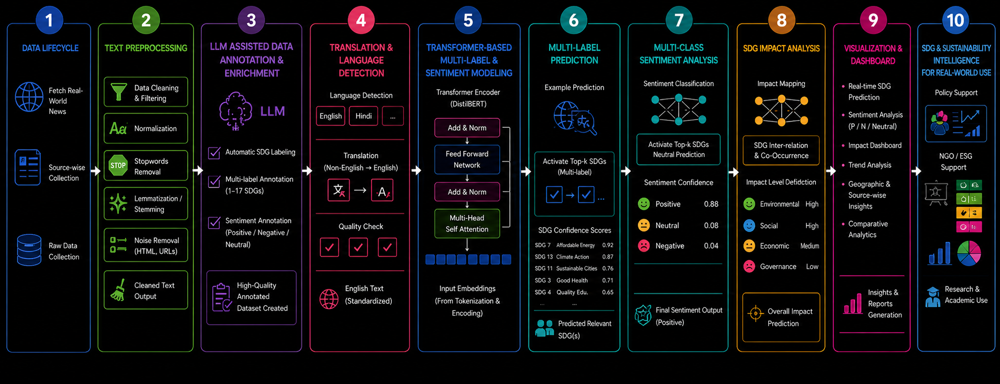
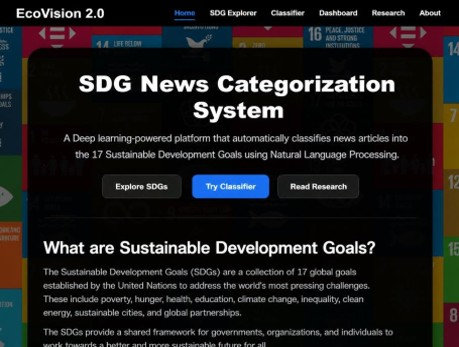
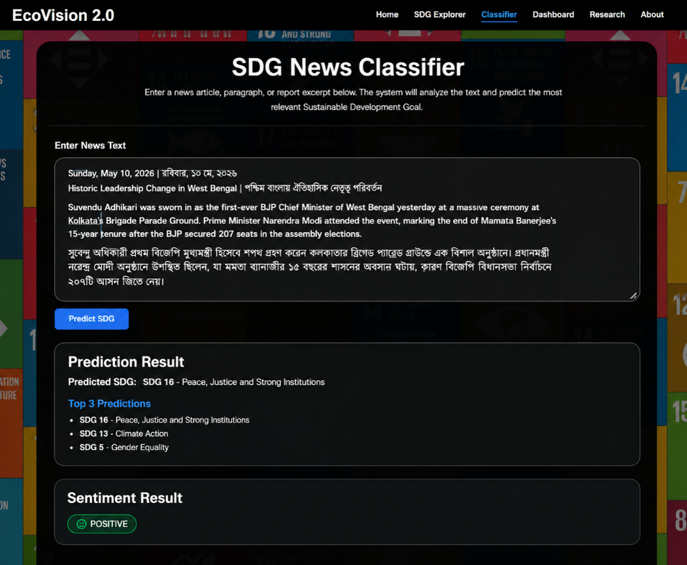
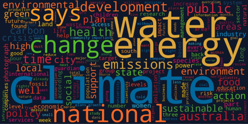
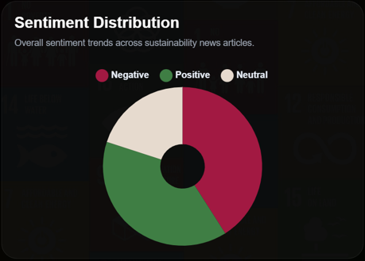

# 🌍 EcoVision 2.0
### AI-Powered Multilingual Sustainable Development Goal (SDG) Intelligence Platform

EcoVision 2.0 is an end-to-end Deep Learning and NLP platform that automatically analyzes news articles and extracted text, identifies the most relevant United Nations Sustainable Development Goals (SDGs), performs sentiment analysis, and generates sustainability insights through an interactive web application.

The system combines multilingual NLP, OCR-based image understanding, Large Language Model (LLM)-assisted annotation, and Transformer-based Deep Learning to create a real-world sustainability intelligence platform.

---

## 🚀 Features

### 🌐 Multilingual Intelligence
- Automatic language detection
- Translation to English
- Unified multilingual prediction pipeline
- Supports global news sources

### 📰 SDG Classification
- Classification across all 17 UN SDGs
- Top-K SDG prediction
- Confidence scoring
- Sustainability impact analysis

### 💬 Sentiment Analysis
- Positive sentiment detection
- Neutral sentiment detection
- Negative sentiment detection

### 🖼️ Image-to-Text Intelligence
- OCR-powered text extraction
- News image understanding
- SDG prediction from extracted text

### 📊 Interactive Analytics Dashboard
- SDG insights
- Sentiment trends
- Sustainability analytics
- Comparative reporting

### 🤖 Deep Learning Powered
- Fine-tuned DistilBERT
- Transformer-based text understanding
- Multi-class SDG prediction
- Multi-class sentiment classification

---

# 🎯 Problem Statement

Every day thousands of sustainability-related articles, reports, and policy updates are published worldwide. Manually mapping these documents to the appropriate United Nations Sustainable Development Goals (SDGs) is time-consuming and difficult.

EcoVision 2.0 automates this process using Artificial Intelligence, enabling organizations, researchers, NGOs, and policymakers to quickly identify sustainability themes and understand the impact of global developments.

---

# 🏗️ System Architecture

<p align="center">
  
</p>

### Pipeline Overview

1. Real-world news collection
2. Text preprocessing and cleaning
3. LLM-assisted SDG annotation
4. Language detection and translation
5. Transformer-based feature extraction
6. SDG prediction
7. Sentiment classification
8. Sustainability impact analysis
9. Dashboard visualization
10. Sustainability intelligence generation

---

# 📸 Application Screenshots

## Home Page

<p align="center">
  
</p>

---

## SDG News Classification

The classifier predicts the most relevant SDG and provides top-k recommendations along with sentiment analysis.

<p align="center">
  
</p>

---

## Sustainability Insights

Word cloud generated from sustainability news articles highlighting dominant themes and concepts.

<p align="center">
  
</p>

---

## Sentiment Analytics Dashboard

Overall sentiment trends across sustainability-related news articles.

<p align="center">
  
</p>

---

# 🧠 Model Architecture

## SDG Classification Model

```text
Input Text
    ↓
Tokenizer
    ↓
DistilBERT Encoder
    ↓
Classification Head
    ↓
17 SDG Probabilities
    ↓
Top-K SDG Prediction
```

### Model Used
- DistilBERT
- Hugging Face Transformers
- PyTorch

---

## Sentiment Classification Model

```text
Input Text
    ↓
DistilBERT
    ↓
Classification Layer
    ↓
Positive
Neutral
Negative
```

---

# 📈 Model Performance

## Validation Performance Across Epochs

<p align="center">
  
</p>

### Results

| Metric | Best Score |
|----------|----------|
| Accuracy | 89.12% |
| Weighted F1 | 89.30% |
| Macro F1 | 84.60% |

---

## Training and Validation Loss

<p align="center">
  
</p>

The model demonstrates strong convergence during training with consistently decreasing training loss and high validation performance.

---

# 📊 Dataset

### Data Sources

- Guardian News Dataset
- Sustainability News Articles
- LLM-Assisted Annotation Pipeline

### Annotation Strategy

The dataset was enriched using a Large Language Model (LLM) to automatically generate:

- SDG labels
- Multi-class classifications
- Sentiment labels

This significantly reduced manual labeling effort while maintaining annotation quality.

---

# 🌎 Supported Sustainable Development Goals

The platform predicts relevance across all 17 United Nations Sustainable Development Goals.

| SDG | Goal |
|------|------|
| SDG 1 | No Poverty |
| SDG 2 | Zero Hunger |
| SDG 3 | Good Health and Well-being |
| SDG 4 | Quality Education |
| SDG 5 | Gender Equality |
| SDG 6 | Clean Water and Sanitation |
| SDG 7 | Affordable and Clean Energy |
| SDG 8 | Decent Work and Economic Growth |
| SDG 9 | Industry, Innovation and Infrastructure |
| SDG 10 | Reduced Inequalities |
| SDG 11 | Sustainable Cities and Communities |
| SDG 12 | Responsible Consumption and Production |
| SDG 13 | Climate Action |
| SDG 14 | Life Below Water |
| SDG 15 | Life on Land |
| SDG 16 | Peace, Justice and Strong Institutions |
| SDG 17 | Partnerships for the Goals |

---

# 🛠️ Technology Stack

## Machine Learning & NLP

- Python
- PyTorch
- Hugging Face Transformers
- DistilBERT
- Scikit-Learn
- NumPy
- Pandas

## Deep Learning

- Multi-Class Text Classification
- Transformer Fine-Tuning
- Sentiment Analysis

## Language Processing

- Language Detection
- Translation Pipeline
- OCR Text Extraction

## Web Application

- Flask
- HTML5
- CSS3
- JavaScript

---

# 📂 Project Structure

```text
EcoVision-2.0/
│
├── app.py
├── requirements.txt
│
├── model/
│   ├── sdg_model/
│   └── sentiment_model/
│
├── templates/
├── static/
│
├── screenshots/
│   ├── home.jpg
│   ├── classifier.png
│   ├── word_cloud.png
│   ├── Sentiment_distribution.png
│   ├── validation across epochs.png
│   ├── training&validation_Across Epochs.png
│   └── system_architecture.png
│
└── README.md
```

---

# ⚙️ Installation

Clone the repository:

```bash
git clone https://github.com/YOUR_USERNAME/ecovision-2.0.git

cd ecovision-2.0
```

Install dependencies:

```bash
pip install -r requirements.txt
```

Run the application:

```bash
python app.py
```

Open:

```text
http://localhost:5000
```

---

# 🔬 Future Enhancements

- Real-time news ingestion
- Explainable AI for SDG predictions
- SDG trend forecasting
- Sustainability recommendation engine
- Knowledge Graph integration
- Retrieval-Augmented Generation (RAG)

---

# 👩‍💻 Author

### Shreya Saihgal

AI Engineer | Machine Learning | Deep Learning | NLP

- LinkedIn: https://www.linkedin.com/in/shreyasaihgal/

---

## ⭐ If you found this project interesting, please consider giving it a star.
